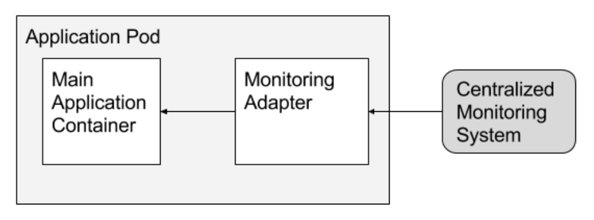

# [Kubernetes](../index)

## [Multi-Container PODs](./index)

### Adapter Pattern

#### Details



#### Use Case - Overview

- It also demonstrates use case for communication between containers via "Shared Storage Volume"

- Use case of emptyDir & hostPath volumes

#### Example - Multi container POD - yaml

```yaml
apiVersion: v1
kind: Pod
metadata:
  name: counter
spec:
  volumes:
  - name: log-volume
    emptyDir: {}
  - name: fluent-conf
    configMap:
      name: fluentd-config
  - name: log-output
    hostPath: 
      path: /usr/ckad/log_output
  containers:
  - name: count
    image: busybox
    command: 
    - /bin/sh
    - -c
    - >
      i=0;
      while true;
      do
        echo "$i: $(date)" >> /var/log/1.log;
        echo "$(date) INFO $i" >> /var/log/2.log;
        i=$((i+1));
        sleep 1;
      done
    volumeMounts:
    - name: log-volume
      mountPath: /var/log
  - name: adapter
    image: k8s.gcr.io/fluentd-gcp:1.30
    env:
    - name: FLUENTD_ARGS
      value: -c /fluentd/etc/fluent.conf
    volumeMounts:
    - name: log-volume
      mountPath: /var/log
    - name: fluent-conf
      mountPath: /fluentd/etc
    - name: log-output
      mountPath: /var/logout
 ```

#### Example - fluent.conf

```xml
<source>
  type tail
  format none
  path /var/log/1.log
  pos_file /var/log/1.log.pos
  tag count.format1
</source>
<source>
  type tail
  format none
  path /var/log/2.log
  pos_file /var/log/2.log.pos
  tag count.format2
</source>
<match **>
  @type file
  path /var/logout/count
  time_slice_format %Y%m%d%H%M%S
  flush_interval 5s
  log_level trace
</match>
 ```

#### Example - Command to create config map from file

```bash
kubectl create configmap fluentd-config --from-file=fluent.conf
 ```
