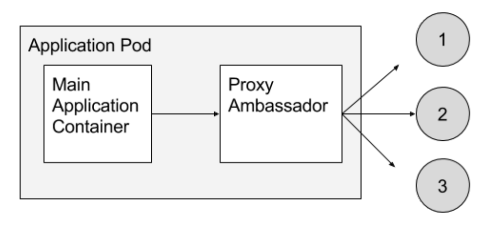

# [Kubernetes](../index)

## [Multi-Container PODs](./index)

### Ambassador Pattern

#### Details



#### Use Case - Overview

- TBD

#### Example - Multi container POD - yaml

```yaml
apiVersion: v1
kind: Pod
metadata:
  name: fruit-service
spec:
  containers:
  - name: legacy-fruit-service-container
    image: linuxacademycontent/legacy-fruit-service:1
  - name: ambassador-container
    image: haproxy:1.7
    volumeMounts:
      - name: config-volume
        mountPath: /usr/local/etc/haproxy
    ports:
    - containerPort: 80
  volumes:
    - name: config-volume
      configMap:
        name: fruit-service-ambassador-config
 ```

#### Example - haproxy.cfg

```cfg
global
    daemon
    maxconn 256

defaults
    mode http
    timeout connect 5000ms
    timeout client 50000ms
    timeout server 50000ms

listen http-in
    bind *:80
    server server1 127.0.0.1:8775 maxconn 32
 ```

#### Example - Command to create config map from file

```bash
kubectl create configmap fruit-service-ambassador-config --from-file=haproxy.cfg
 ```
