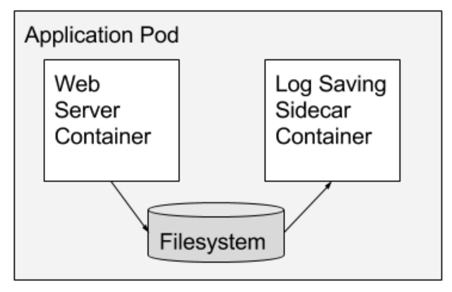

# [Kubernetes](../index)

## [Multi-Container PODs](./index)

### Sidecar Pattern

#### Details



#### Use Case - Overview

- TBD

#### Example - Multi container POD - yaml

```yaml
apiVersion: v1
kind: Pod
metadata:
  name: counter
spec:
  containers:
  - name: count
    image: busybox
    command:
    - /bin/sh
    - -c
    - >
      i=0;
      while true;
      do
        echo "$i: $(date)" >> /var/log/1.log;
        echo "$(date) INFO $i" >> /var/log/2.log;
        i=$((i+1));
        sleep 1;
      done
    volumeMounts:
    - name: varlog
      mountPath: /var/log
  - name: count-log-1
    image: busybox
    command:
    - /bin/sh
    - -c
    - tail -n+1 -f /var/log/1.log
    volumeMounts:
    - name: varlog
      mountPath: /var/log
  - name: count-log-2
    image: busybox
    command:
    - /bin/sh
    - -c
    - tail -n+1 -f /var/log/2.log
    volumeMounts:
    - name: varlog
      mountPath: /var/log
  volumes:
  - name: varlog
    emptyDir: {}
 ```

 [back](./)